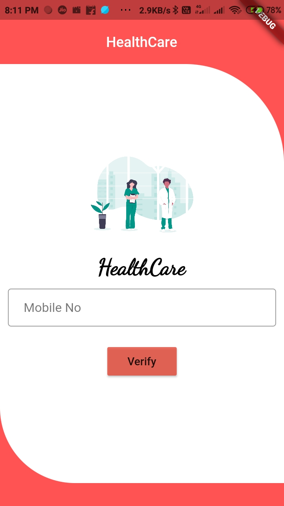

# Firebase Phone Authentication.

A new Flutter package project.

## Getting Started

This project is a starting point for a Dart
[package](https://flutter.dev/developing-packages/),
a library module containing code that can be shared easily across
multiple Flutter or Dart projects.

For help getting started with Flutter, view our 
[online documentation](https://flutter.dev/docs), which offers tutorials, 
samples, guidance on mobile development, and a full API reference.

## Flutter package to Easy Implimaintaion of Firebase Phone Authentication and also provide *animated*, 🥰 *Attractive*, 🎨*stylish* Login Page for phone authentication.

<table style="width:100%">
  <tr>
    <th><b>1.Firebase Phone Authentication <b></b></th>
      
  </tr>
  <tr>
    <td></td>
  </tr>
</table>


# Introduction

**Firebase Phone Authentication** library is built upon Flutter `firebase_auth library`. This API will be useful to create phone authentication animated, login page  in Flutter  easily. 

<table style="width:100%">
  <tr>
    <th><b>1.Mobile Number verification<b></b></th>
    <th>2. OTP Validation</th>
  </tr>
  <tr>
    <td>This is Main login Window which has one Mobile number Filed And Verify Button for verification (Same as Login Page) as you can see below.</td>
    <td>This is Alert Dialog For OTP validation which has OTP filed which is showed after click on varify Button as you can see below.</td> 
  </tr>
  <tr>
    <td align="center"></td>
    <td align="center"></td> 
  </tr>
</table>

## Implementation
Implementation of Firebase Phone Authentication library is so easy. You can check [/test](/test) directory for demo. Let's have look on basic steps of implementation.

### Create Firebase-PhoneAuthentication Instance
As there are two types of dialogs in library. Material Dialogs are instantiated as follows.
#### i. Phone Authentication -
`FirebasePhoneAuth` class is used to create Phone Authentication . Its dynamic `state` class is used to instantiate it. 
```dart


       FirebasePhoneAuth(
       
      theamColor: Colors.redAccent,
      
      title: "HealthCare",
      
      imgPath:"assets/images/doctors.png",
      
      redirectTo: "/homepage", // pass the homepage of your project
    ) 


```


#### ii. How to include in Main File.
## Create a file like `authservice.dart`

```dart
import 'dart:ui';
import 'package:flutter/material.dart';
import 'package:firebase_auth/firebase_auth.dart';
import 'phoneauth.dart';
import 'homepage.dart';

class MyApp extends StatelessWidget {
  @override
  Widget build(BuildContext context) {
    return MaterialApp(
      title: 'Phone Authentication',
      routes: <String, WidgetBuilder>{
        '/homepage': (BuildContext context) => DashboardPage(),
        '/loginpage': (BuildContext context) => MyApp(),
      },
      theme: ThemeData(
        primarySwatch: Colors.orange,
      ),
      home: 
      FirebasePhoneAuth(
      theamColor: Colors.redAccent,
      title: "HealthCare",
      imgPath:"assets/images/doctors.png",
      redirectTo: "/homepage",

      ),
    );
  }
}
```

## iii. Check User Login or not using following Code `main.dart`

```dart

import 'package:firebase_auth/firebase_auth.dart';
import 'package:flutter/material.dart';
import 'homepage.dart'; 
import 'authservice.dart';   

  FirebaseAuth _auth = FirebaseAuth.instance;

void main() async {
  WidgetsFlutterBinding.ensureInitialized();
  // Set default home.
  Widget _defaultHome = new MyApp();

  // Get result of the login function.
   FirebaseUser currentUser = await _auth.currentUser();
  //  _defaultHome = new DashboardPage();
      if (currentUser != null) {
        // User is logged in
        _defaultHome = new DashboardPage();
      } 
  // Run app!
  runApp(new MaterialApp(
    title: 'App',
    home: _defaultHome,
    routes: <String, WidgetBuilder>{
      // Set routes for using the Navigator.
      '/homepage': (BuildContext context) => new DashboardPage(),
      '/loginpage': (BuildContext context) => new MyApp()
    },
  ));
}


```
## Credits
This library is built using following open-source libraries.
- [Material Components for Flutter]
- [Firebase_Auth]
