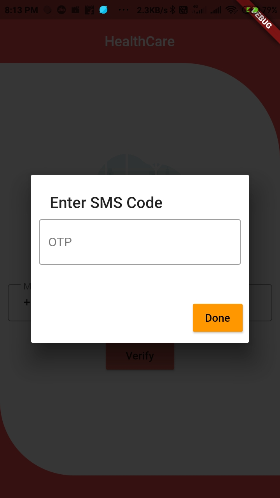

# Firebase Phone Authentication.

A new Flutter package project.

## Getting Started

This project is a starting point for a Dart
[package](https://flutter.dev/developing-packages/),
a library module containing code that can be shared easily across
multiple Flutter or Dart projects.

For help getting started with Flutter, view our 
[online documentation](https://flutter.dev/docs), which offers tutorials, 
samples, guidance on mobile development, and a full API reference.

## Flutter package to Easy Implimaintaion of Firebase Phone Authentication and also provide *animated*, 🥰 *Attractive*, 🎨*stylish* Login Page for phone authentication.

<table style="width:100%">
  <tr>
    <th><b>1.Firebase Phone Authentication <b></b></th>
      
  </tr>
  <tr>
    <td></td>
  </tr>
</table>

# Introduction

**MaterialAlerDialog** library is built upon Flutter Material Design library. This API will be useful to create rich, animated, beautiful dialogs in Flutter  easily. 

<table style="width:100%">
  <tr>
    <th><b>1.Mobile Number verification<b></b></th>
    <th>2. OTP Validation</th>
  </tr>
  <tr>
    <td>This is Main login Window which has one Mobile number Filed And Verify Button for verification (Same as Login Page) as you can see below.</td>
    <td>This is Alert Dialog For OTP validation which has OTP filed which is showed after click on varify Button as you can see below.</td> 
  </tr>
  <tr>
    <td align="center"></td>
    <td align="center"></td> 
  </tr>
</table>
